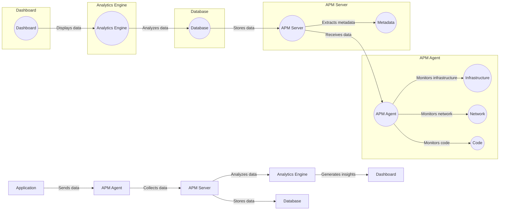

## Overall Architecture

```mermaid
graph LR
A[Application] -->|Sends data| B[APM Agent]
B -->|Collects data| C[APM Server]
C -->|Stores data| D[Database]
C -->|Analyzes data| E[Analytics Engine]
E -->|Generates insights| F[Dashboard]

subgraph APM Agent
B1((APM Agent)) -->|Monitors code| B2((Code))
B1 -->|Monitors network| B3((Network))
B1 -->|Monitors infrastructure| B4((Infrastructure))
end

subgraph APM Server
C1((APM Server)) -->|Receives data| B1
C1 -->|Extracts metadata| C2((Metadata))
end

subgraph Database
D1((Database)) -->|Stores data| C1
end

subgraph Analytics Engine
E1((Analytics Engine)) -->|Analyzes data| D1
end

subgraph Dashboard
F1((Dashboard)) -->|Displays data| E1
end
```
